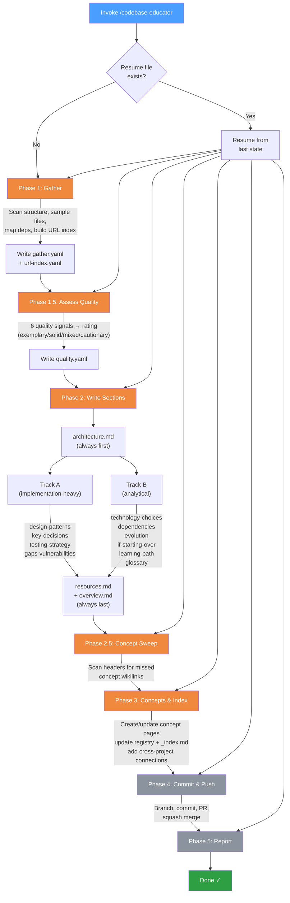

# Codebase Educator

A Claude Code skill that analyzes any codebase and produces a structured educational brief — not a lint report or audit, but a deep explanation of *why* things were built the way they were.

Feed it a local project, a GitHub repo, a website, or a published package. It produces an Obsidian-compatible vault of interconnected notes covering architecture, technology choices, design patterns, trade-offs, and lessons learned.

## What It Produces

Each analysis generates a project folder with 12 documents:

| Document | What You Learn |
|----------|----------------|
| **_overview.md** | Executive summary, source link, quality rating, key takeaways |
| **architecture.md** | System structure, layers, data flow (with Mermaid diagrams) |
| **technology-choices.md** | Stack decisions — what was chosen, why, and what the alternatives were |
| **design-patterns.md** | Patterns in use, quality of application, anti-patterns spotted |
| **key-decisions.md** | Non-obvious choices that shaped the codebase, inferred rationale |
| **gaps-vulnerabilities.md** | Architectural weak points, missing patterns, specialist audit referrals |
| **dependencies.md** | Dependency philosophy — build vs. buy decisions, risk assessment |
| **evolution.md** | How the codebase evolved over time, migration artifacts, sedimentary layers |
| **testing-strategy.md** | What's tested, how, what's missing, and what the approach reveals |
| **if-starting-over.md** | Lessons learned — what to keep, change, add, and drop |
| **learning-path.md** | Ordered reading list through the codebase with difficulty tags |
| **glossary.md** | Domain and technical terms defined in context |

Every section ends with a **"Why This Matters"** explanation of the transferable principle — so you learn concepts that apply beyond the specific project.

## The Concept Graph

This is where the real value compounds.

Analyses link to shared concept pages (`_concepts/`) using Obsidian wikilinks. When you analyze Express and it uses the middleware pattern, the skill links to `[[middleware-pattern]]`. When you later analyze Fastify, same link. Open the vault in Obsidian and the graph view shows which projects share architectural DNA — and where they diverge.

Over time, `_concepts/` becomes a personal architecture encyclopedia grounded in real code you've studied.

## Quality Assessment

Not all code is worth emulating. The skill evaluates six quality signals before writing the brief and assigns a rating:

| Rating | Framing |
|--------|---------|
| **Exemplary** | "Learn from this — here's why it works" |
| **Solid** | "Learn from this, with caveats in specific areas" |
| **Mixed** | "Learn selectively" — each pattern explicitly tagged |
| **Cautionary** | "Learn what not to do" — every pattern gets the correct alternative |

Bad code is still educational — the skill just frames it honestly so you never mistake an anti-pattern for a best practice.

## Supported Sources

| Source | Example | Method |
|--------|---------|--------|
| Current project | `/codebase-educator` | Direct file access |
| Local path | `/codebase-educator ~/projects/my-app` | Direct file access |
| GitHub repo | `/codebase-educator https://github.com/expressjs/express` | Shallow clone |
| Website | `/codebase-educator https://stripe.com` | Observable analysis (limited sections) |
| npm package | `/codebase-educator npm:fastify` | Download and extract source |
| PyPI package | `/codebase-educator pypi:flask` | Download and extract source |

## Installation

### Prerequisites

- [Claude Code](https://docs.anthropic.com/en/docs/claude-code) CLI installed and configured
- Git (for GitHub repo analysis)
- npm (for npm package analysis, optional)
- pip (for PyPI package analysis, optional)
- [Obsidian](https://obsidian.md/) (optional, for vault visualization)

### Setup

1. Clone this repo:

```bash
git clone https://github.com/steveKit/codebase-educator.git
```

2. Symlink into your Claude Code skills directory:

```bash
ln -s /path/to/codebase-educator ~/.claude/skills/codebase-educator
```

3. That's it. The skill is now available as `/codebase-educator` in any Claude Code session.

### Vault Location

The skill writes all output to `~/.claude/educator-briefs/`. To view it in Obsidian, open that folder as a vault. The skill bootstraps Obsidian config on first run.

## Usage

In any Claude Code session:

```
# Analyze the current project
/codebase-educator

# Analyze a local path
/codebase-educator ~/projects/my-api

# Analyze a GitHub repo
/codebase-educator https://github.com/fastify/fastify

# Analyze a website's observable architecture
/codebase-educator https://linear.app

# Analyze a published package
/codebase-educator npm:express
/codebase-educator pypi:django
```

## How It Works

The skill uses a **state machine** with **disk registers** for restartability
and context efficiency. If a run crashes mid-way, re-invoke the skill and it
picks up where it left off.

### Workflow



### State Machine

Each phase transitions through a linear state machine. The state file in
`/tmp/educator-<name>/state.yaml` records progress so any interrupted run
can resume without re-doing completed work.

```
INIT → GATHERING → GATHERED → ASSESSED → WRITING → SECTIONS_DONE
→ SWEPT → CONCEPTS_DONE → COMMITTED → COMPLETE
```

### Registers

Instead of carrying raw source code through every phase, the skill writes
structured data to disk registers that downstream phases read on demand:

| Register | Written by | Purpose |
|----------|-----------|---------|
| `state.yaml` | Orchestrator | Workflow progress + resume point |
| `gather.yaml` | Phase 1 | Structured codebase data (replaces raw file content) |
| `url-index.yaml` | Phase 1 | Technology link lookup table |
| `quality.yaml` | Phase 1.5 | Quality rating + per-section tone guidance |
| `sections.yaml` | Phase 2 | Per-section metadata (concepts, URLs, word counts) |

This register architecture means each section writer loads only what it needs —
its own template + the three data registers + 2-5 targeted file reads — rather
than the entire gathered context.

## Philosophy

- **Teach, don't lecture.** Written as a knowledgeable colleague, not a textbook.
- **Honest assessment.** If the code is messy, say so — but explain what forces likely led there.
- **No moralizing.** Style preferences aren't gaps. Focus on architecture and design.
- **Transferable knowledge first.** Every observation teaches a principle that applies elsewhere.
- **Bad code is educational.** The skill never refuses to analyze — it just frames honestly.

## License

MIT
