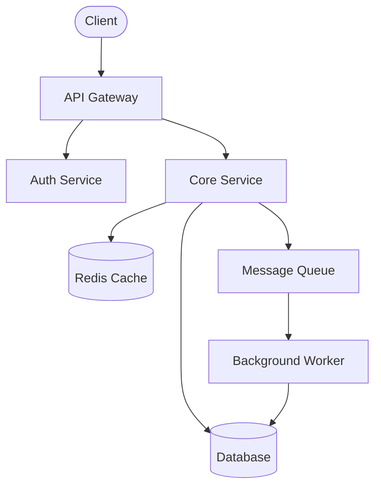
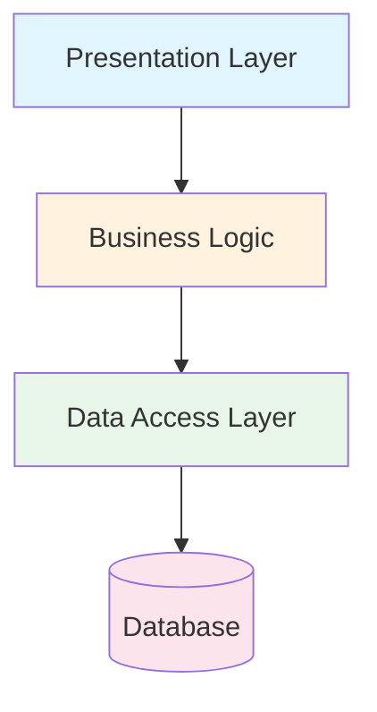
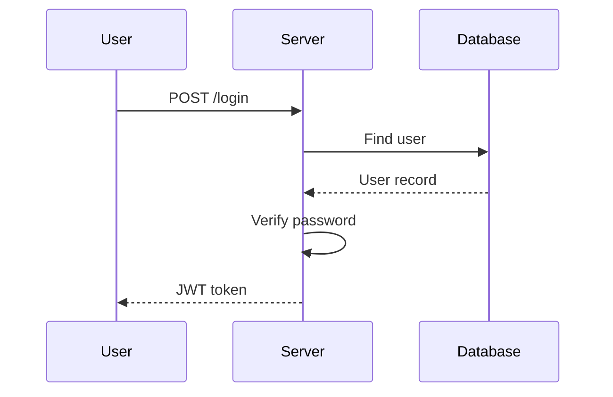
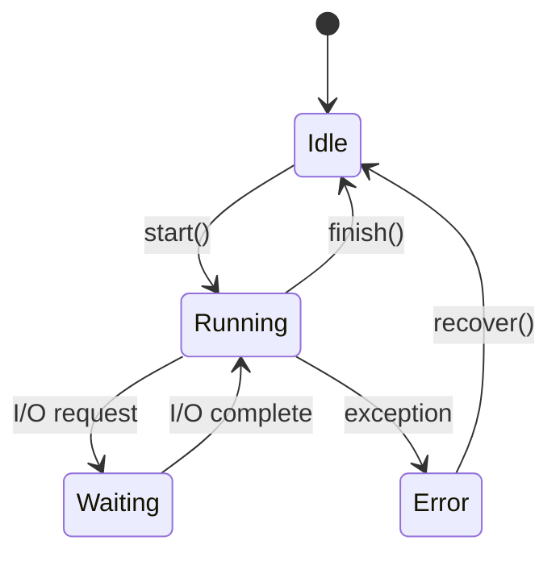

# Mermaid Diagram Guide

Obsidian renders Mermaid diagrams natively as SVG. They reflow on any screen
size — desktop, tablet, mobile — unlike ASCII box-drawing which breaks on
narrow viewports.

## When to Use Each Diagram Type

| Situation | Mermaid Type | Why |
|---|---|---|
| System architecture, component relationships | `graph TD` or `graph LR` | Shows hierarchy and connections |
| Layer stacks (presentation / logic / data) | `graph TD` | Top-to-bottom flow maps to layers naturally |
| Data flow through a request | `sequenceDiagram` | Shows order and participants clearly |
| State machines, lifecycle | `stateDiagram-v2` | Purpose-built for state transitions |
| Class/module relationships | `classDiagram` | Shows inheritance, composition, dependencies |
| Timeline / evolution | `timeline` | Chronological events |

## Syntax Patterns

### System Architecture (graph)



### Layer Stack



### Data Flow (sequence)



### Concurrency / State



## Style Rules

1. **Keep nodes short.** Use 2-4 word labels. Add detail in the surrounding
   prose, not in the diagram.

2. **Limit to ~12 nodes per diagram.** Split complex systems into multiple
   focused diagrams rather than one sprawling one. A "System Overview" diagram
   plus per-subsystem detail diagrams is better than a single mega-diagram.

3. **Use shape semantics consistently:**
   - `[Square]` — modules, services, components
   - `([Stadium])` — external actors, entry points
   - `[(Cylinder)]` or `[(Database)]` — data stores
   - `{Diamond}` — decision points
   - `((Circle))` — events, triggers

4. **Direction matters:**
   - `graph TD` (top-down) — layer stacks, hierarchies
   - `graph LR` (left-right) — pipelines, sequential flows
   - Pick the direction that matches the mental model

5. **Subgraphs for boundaries:**
   ```mermaid
   graph TD
       subgraph Frontend
           UI[React App]
           Router[Router]
       end
       subgraph Backend
           API[API Server]
           Auth[Auth]
       end
       UI --> API
   ```

6. **Color sparingly.** Use `style` only to highlight architectural boundaries
   or to distinguish layer types. Don't make it a rainbow.

7. **No inline wikilinks.** Mermaid node labels can't contain `[[links]]`.
   Place concept links in the prose paragraph immediately after the diagram.

## Common Mistakes

- **Too many nodes:** If you can't read it comfortably, split it.
- **Long labels:** `[UserAuthenticationAndSessionManagementService]` — shorten
  to `[Auth Service]` and explain in text.
- **Mixing concerns:** One diagram, one story. Don't show data flow AND
  deployment topology AND class hierarchy in the same diagram.
- **Missing legend:** If shapes or colors carry meaning beyond the defaults,
  add a one-line note below the diagram explaining the convention.
